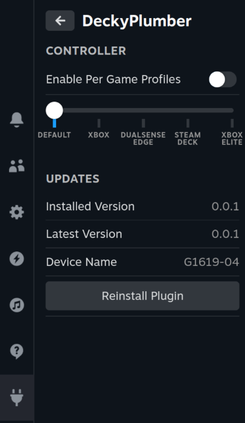

# DeckyPlumber - Decky Plugin

Proof of Concept Decky Plugin for changing InputPlumber controller mode



# Prerequisites

Works only on devices with InputPlumber running

# Install

### Prerequisites

Decky Loader must already be installed.

### Quick Install / Update

Run the following in terminal, then reboot. Note that this works both for installing or updating the plugin

```
curl -L https://github.com/aarron-lee/DeckyPlumber/raw/main/install.sh | sh

```

### Manual Install

Download the latest release from the [releases page](https://github.com/aarron-lee/DeckyPlumber/releases)

Unzip the `tar.gz` file, and move the `DeckyPlumber` folder to your `$HOME/homebrew/plugins` directory

then run:

```
sudo systemctl restart plugin_loader.service
```

then reboot your machine.

## Manual build

Dependencies:

- Node.js v16.14+ and pnpm installed

```bash
git clone https://github.com/aarron-lee/DeckyPlumber.git

cd DeckyPlumber

# if pnpm not already installed
npm install -g pnpm

pnpm install
pnpm update decky-frontend-lib --latest
pnpm run build
```

Afterwards, you can place the entire `DeckyPlumber` folder in the `~/homebrew/plugins` directly, then restart your plugin service

```bash
sudo systemctl restart plugin_loader.service
```

# Attribution

Built using Decky Plugin Template: https://github.com/SteamDeckHomebrew/decky-plugin-template/
